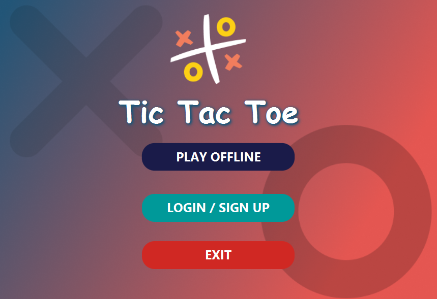
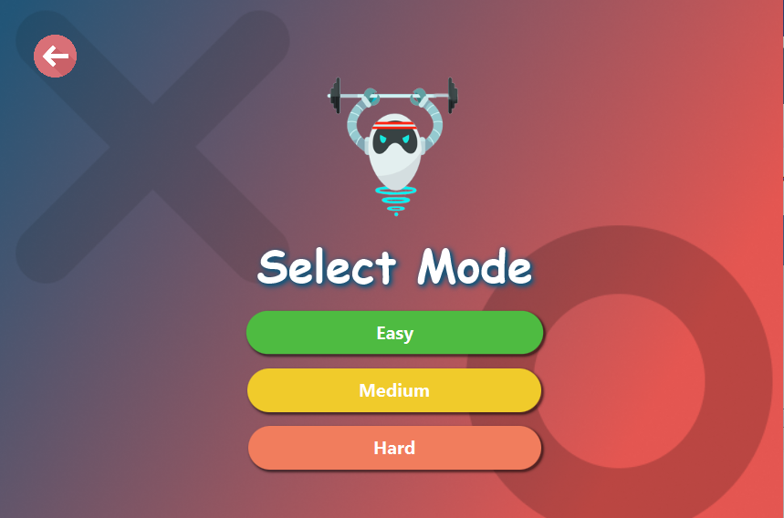
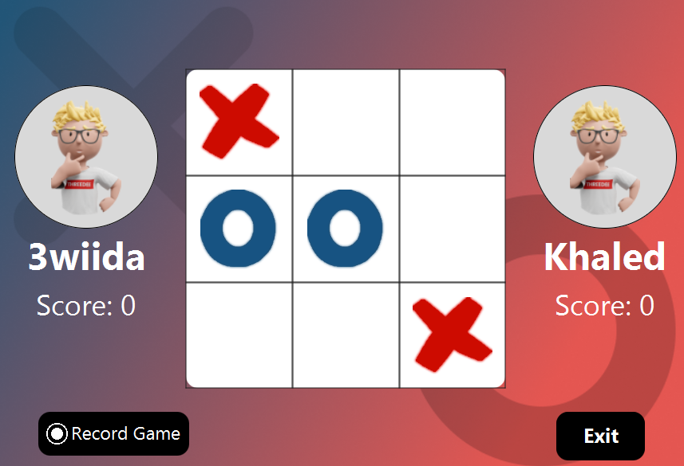
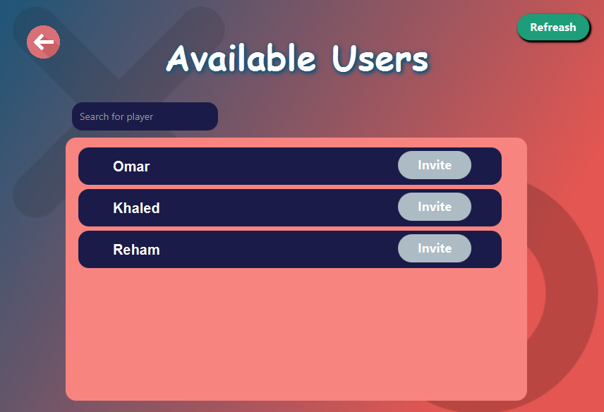
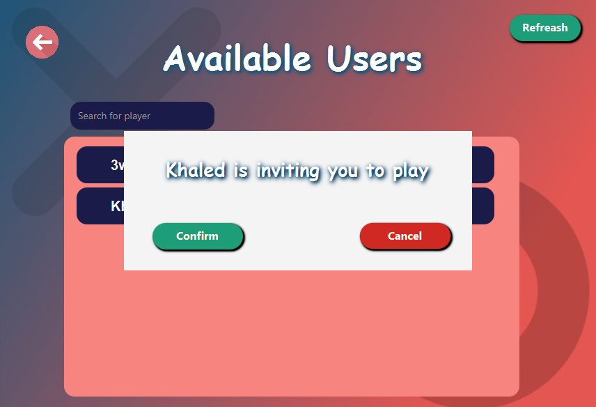
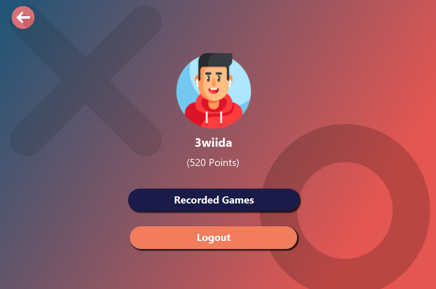

# TicTacToe Client

A feature-rich Tic Tac Toe game with AI, local and online multiplayer, score tracking, game recording, and fun win/loss animations.

This comes as the final project of Java course at ITI.    

## Screenshots

    
    
    
    
    
    

### 🧑🏻‍💻 Tech Stack

- Application view is entirely written in [JavaFX](https://openjfx.io/) and [CSS](https://developer.mozilla.org/en-US/docs/Web/CSS).
- [Java Sockets](https://docs.oracle.com/javase/tutorial/networking/sockets/index.html) for online communication.
- Asynchronous processing using [Java Threads](https://docs.oracle.com/javase/7/docs/api/java/lang/Thread.html)
- [Json](https://www.json.org/json-en.html) for passing messages between the client and server.
- Architectural pattern using [MVC](https://en.wikipedia.org/wiki/Model%E2%80%93view%E2%80%93controller)

### Features ✨

- Play offline against the computer with 3 difficulty levels: Easy, Medium, and Hard.
- Challenge a friend locally on the same device.
- Login/Register to save your scores and track your progress.
- Play online with players on remote devices.
- Record your games and relive the fun later.
- Enjoy funny videos based on your game outcome (win, lose, or draw)!

### How to install and run❔

1- Clone the project. 
2- Open it from [Netbeans.](https://netbeans-ide.en.softonic.com/download) 
3- Download [org.json](https://jar-download.com/artifacts/org.json/json/20230227/source-code)  jar file. 
4- Add this jar file for the project libraries in netbeans. 
5- Run the project. 

### Acknowledgments 🙌  

A huge **thank you** to my amazing teammates for their dedication, hard work, and collaboration throughout this project. This game wouldn’t have been possible without your efforts! 🎉  

**Team Members:**  
- [Mahmoud Ewida](https://github.com/3wiida)  
- [Khaled Mustafa](https://github.com/KhaledMustafaAhmed)  
- [Omar Abdulaziz](https://github.com/omarabdulaziz259)  
- [Reham Ibrahem](https://github.com/reham2002ibrahim)  

It was an incredible journey working together—debugging, brainstorming, and bringing this game to life. Thank you all for making this project a success! 🚀  

## Find this repository useful? :heart:
Support it by putting a star for this repository. :star:
